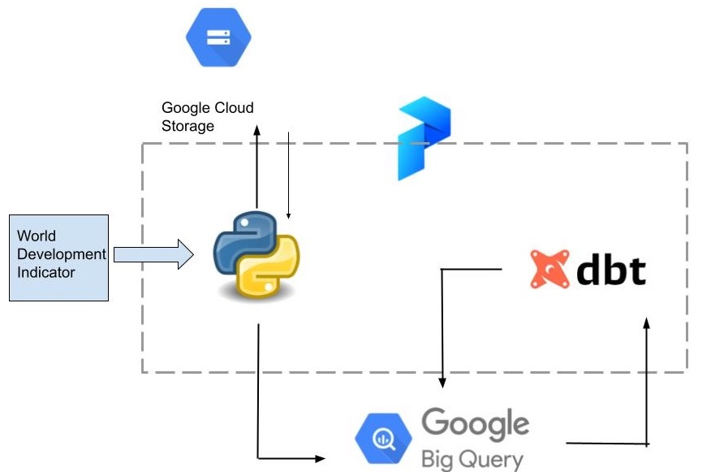

# Data Pipeline for Economic Analysis

This is a data pipeline to download data from World Bank using its World Development Indicator data bank.

## Pipeline Description
The data pipeline can serve as a template to analyse different World Development Indicators for different countries. 


Prefect is used to orchestrate the pipeline.

```shell
python etl/mainflow.py
```

It starts with downloading data from world bank data bank, uploads the raw data to google cloud. Then data is filtered with the indicators, countries and years that are of interests, and gets uploaded to big query. DBT is used to further model the data to prepare for report and analysis.




## Analysis
For this project, we look into carbon dioxide emissions and economic indicators of top 5 countries in South East Asia with the highest GDP, namely Indonesia, Thailand, Singapore, Vietnam, and Philippines. There's a theory that a country would likely face tradeoffs in minimizing the carbon emissions while trying to grow its economy. We wanted to visualize the last 10 year GDP and Carbon Dioxide emission to explore if there's any connection in a country's GDP and CO2 emissions. 

Dashboard - https://lookerstudio.google.com/u/0/reporting/58cd5b1a-440d-4055-b557-10fc527c2cdf/page/7CeLD


## Try it yourself, You need:

1. [Google Cloud Platform account](https://console.cloud.google.com/)
2. gcp project
3. [gcp credential](https://developers.google.com/workspace/guides/create-credentials)
4. [Terraform](https://developer.hashicorp.com/terraform/tutorials/aws-get-started/install-cli)
5. Python 3.9 or above

### Set up

1. After installing python, install dependencies:
    on the project directory run:
    ```shell
    pip install -r requirements.txt
    ```

2. Populate config.json, 
    - "project_id" is your gcp project
    - "region" is which [google cloud region](https://cloud.google.com/about/locations#americas) you want to deploy your resources  
    - "storage_class" - for your gcp [bucket](https://cloud.google.com/storage/docs/storage-classes)
    - "secret_path" - location of google cloud credentials json file. 
    - "data_lake_bucket" - what you want to name your bucket
    - "bq_dataset" - what you want to name your big query data set
    - "bq_ds_for_dbt" - what you want to name another data set for big query to communicate with dbt

### Run the project
1. Create resources with terraform
```shell
terraform init

terraform apply
```

2. Run the pipeline
```shell
python etl/mainflow.py
```


After this, you can now start your [data modeling with dbt](https://docs.getdbt.com/reference/warehouse-setups/bigquery-setup#dataset-locations) and analyse your data with [looker](https://support.google.com/looker-studio/answer/12269110?hl=en)

To destroy resources in google cloud:

```shell
terraform destroy
```


